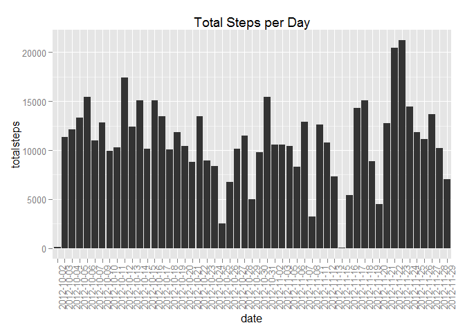
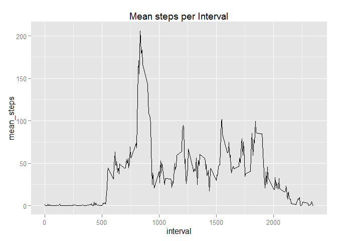
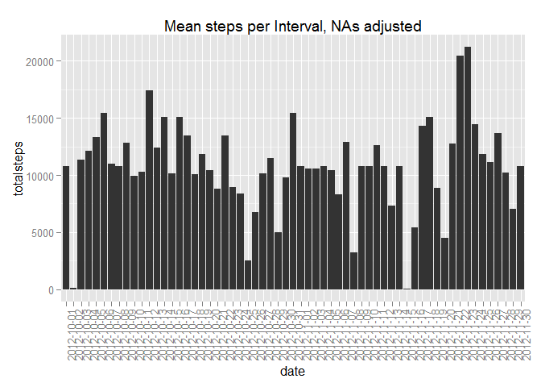
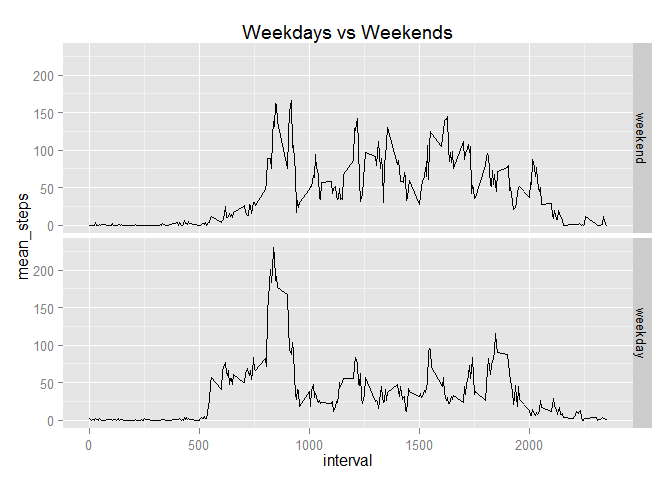

# Reproducible Research Assignment 1
Martin Peak  
Sunday, December 07, 2014  
This assignment makes use of data from a personal activity monitoring device. 
This device collects data at 5 minute intervals through out the day. The data consists of
two months of data from an anonymous individual collected during the months of October 
and November, 2012 and include the number of steps taken in 5 minute intervals each day.

This first code chunk unzips the activity csv file, and reads it into R. The
second line of code creates a dataset with the NA values removed.

```r
activitydatawithNAs <- read.csv(unzip('activity.zip'))
activitydata <- activitydatawithNAs[complete.cases(activitydatawithNAs),]
```

I then create a new dataframe that summarises the total number of steps per day

```r
suppressMessages(library(dplyr))
steps_per_day <- summarise(group_by(activitydata, date),
                           meansteps = mean(steps),
                           totalsteps = sum(steps)) 
```

I now create a histogram of the total steps data

```r
suppressMessages(library(ggplot2))
g1 <- ggplot(steps_per_day, aes(x=date, y = totalsteps)) + geom_histogram(stat='identity')
g1 + ggtitle('Total Steps per Day') + theme(axis.text.x = element_text(angle = 90, hjust = 1))
```

 

The average number of steps per day is 1.0766189\times 10^{4}.
The median number of steps per day is 10765.

Below is a time series plot of mean steps per interval


```r
steps_per_day_per_interval <- summarise(group_by(activitydata, interval),
                                         mean_steps = mean(steps))

m <- ggplot(steps_per_day_per_interval, aes(interval, mean_steps))
 m + geom_line()             + ggtitle('Mean steps per Interval') 
```

 

```r
rm(m)
rm(steps_per_day)
```


```r
steps_per_day_per_interval <- arrange(steps_per_day_per_interval, desc(mean_steps))
max <- steps_per_day_per_interval[1,1]
```

The interval with the maximum number of steps is interval number 835.


```r
activitydataNAs <- activitydatawithNAs[!complete.cases(activitydatawithNAs),]
NumberofNAs <- count(activitydataNAs)
colnames(NumberofNAs) <- "Total number of NAs"
NumberofNAs
```

```
## Source: local data frame [1 x 1]
## 
##   Total number of NAs
## 1                2304
```

The number of NA's in the activitydata dataset are 2304.

My strategy for replacing the missing values (NAs) will be to replace them with the mean number of steps for that interval (working shown below).


```r
suppressMessages(detach("package:dplyr", unload=TRUE))
suppressMessages(library(plyr))
activitydataNAsremoved <- join(activitydatawithNAs, steps_per_day_per_interval, by = "interval")
activitydataNAsremoved$steps <- ifelse(is.na(activitydataNAsremoved$steps), activitydataNAsremoved$mean_steps, activitydataNAsremoved$steps)
suppressMessages(detach("package:plyr"))
```

Below is the histogram of total steps taken each day, for the dataset with NAs replaced.
The difference between the first and second histogram is not noticeable, apart from the fact that there are more days that have data in the second histogram. The average and median steps per day, have not significantly changed, although the median has increased slightly. 


```r
suppressMessages(library(dplyr))
steps_per_day <- summarise(group_by(activitydataNAsremoved, date),
                           meansteps = mean(steps),
                           totalsteps = sum(steps)) 

suppressMessages(library(ggplot2))
ggplot(steps_per_day, aes(x=date, y = totalsteps)) + geom_histogram(stat='identity') + ggtitle('Mean steps per Interval, NAs adjusted') + theme(axis.text.x = element_text(angle = 90, hjust = 1))
```

 

The average number of steps per day is 1.0766189\times 10^{4}.  
The median number of steps per day is 1.0766189\times 10^{4}.

I am now creating a new factor variable to split the data into weekdays and weekends, and plotting the two factors in a panel plot to observe any differences.


```r
activitydataNAsremoved$date <- as.Date(activitydataNAsremoved$date)
activitydataNAsremoved$weekday <- weekdays(activitydataNAsremoved$date)
activitydataNAsremoved$weekend <- ifelse(activitydataNAsremoved$weekday %in% c('Saturday','Sunday'), 1, 2)
activitydataNAsremoved$weekend <- factor(activitydataNAsremoved$weekend, levels = c(1,2), 
                                      labels = c("weekend", "weekday"))
```


```r
suppressMessages(library(dplyr))
steps_per_interval_weekend <- summarise(group_by(activitydataNAsremoved, interval, weekend),
                                         mean_steps = mean(steps))

p1 <- ggplot(steps_per_interval_weekend, aes(interval, mean_steps)) 
 p2 <- p1 + geom_line()

panelplot <- p2 + facet_grid(weekend ~ .) + ggtitle('Weekdays vs Weekends')
panelplot
```

 
